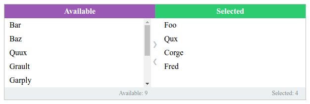

# react-multiselect-two-sides

[![Commitizen friendly][commitizen-image]][commitizen-url]
[![XO code style][codestyle-image]][codestyle-url]

[![NPM version][npm-image]][npm-url]
[![Build Status][travis-image]][travis-url]
[![Dependency Status][depstat-image]][depstat-url]
[![DevDependency Status][depstat-dev-image]][depstat-dev-url]

> React multiselect two sides component

Demo: [vovanr.github.io/react-multiselect-two-sides][demo]



## Install

```
npm install --save react-multiselect-two-sides
```

## Usage
See: [example](example/app.jsx)

```js
const App = React.createClass({
    getInitialState() {
        return {
            options: [
                {name: 'Foo', value: 0},
                {name: 'Bar', value: 1},
                {name: 'Baz', value: 2, disabled: true},
                {name: 'Qux', value: 3},
                {name: 'Quux', value: 4},
                {name: 'Corge', value: 5},
                {name: 'Grault', value: 6},
                {name: 'Garply', value: 7},
                {name: 'Waldo', value: 8},
                {name: 'Fred', value: 9},
                {name: 'Plugh', value: 10},
                {name: 'Xyzzy', value: 11},
                {name: 'Thud', value: 12}
            ],
            value: [0, 3, 9]
        };
    },

    handleChange(value) {
        this.setState({value});
    },

    render() {
        const {options, value} = this.state;
        const selectedCount = value.length;
        const availableCount = options.length - selectedCount;

        return (
            <MultiselectTwoSides
                {...this.state}
                className="msts_theme_example"
                onChange={this.handleChange}
                availableHeader="Available"
                availableFooter={`Available: ${availableCount}`}
                selectedHeader="Selected"
                selectedFooter={`Selected: ${selectedCount}`}
                showControls
                searchable
                />
        );
    }
});

ReactDOM.render(<App/>, document.getElementById('app'));
```

## Api

```js
MultiselectTwoSides.propTypes = {
    availableFooter: React.PropTypes.node,
    availableHeader: React.PropTypes.node,
    className: React.PropTypes.string,
    clearFilterText: React.PropTypes.string,
    clearable: React.PropTypes.bool,
    deselectAllText: React.PropTypes.string,
    disabled: React.PropTypes.bool,
    filterComponent: React.PropTypes.func,
    highlight: React.PropTypes.array,
    labelKey: React.PropTypes.string,
    limit: React.PropTypes.number,
    onChange: React.PropTypes.func,
    options: React.PropTypes.array,
    placeholder: React.PropTypes.string,
    searchable: React.PropTypes.bool,
    selectAllText: React.PropTypes.string,
    selectedFooter: React.PropTypes.node,
    selectedHeader: React.PropTypes.node,
    showControls: React.PropTypes.bool,
    value: React.PropTypes.array,
    valueKey: React.PropTypes.string
};

MultiselectTwoSides.defaultProps = {
    clearFilterText: 'Clear',
    clearable: true,
    deselectAllText: 'Deselect all',
    disabled: false,
    highlight: [],
    labelKey: 'label',
    options: [],
    searchable: false,
    selectAllText: 'Select all',
    showControls: false,
    value: [],
    valueKey: 'value'
};
```

## License
MIT © [Vladimir Rodkin](https://github.com/VovanR)

[demo]: http://vovanr.github.io/react-multiselect-two-sides

[commitizen-url]: http://commitizen.github.io/cz-cli/
[commitizen-image]: https://img.shields.io/badge/commitizen-friendly-brightgreen.svg?style=flat-square

[codestyle-url]: https://github.com/sindresorhus/xo
[codestyle-image]: https://img.shields.io/badge/code_style-XO-5ed9c7.svg?style=flat-square

[npm-url]: https://npmjs.org/package/react-multiselect-two-sides
[npm-image]: https://img.shields.io/npm/v/react-multiselect-two-sides.svg?style=flat-square

[travis-url]: https://travis-ci.org/VovanR/react-multiselect-two-sides
[travis-image]: https://img.shields.io/travis/VovanR/react-multiselect-two-sides.svg?style=flat-square

[depstat-url]: https://david-dm.org/VovanR/react-multiselect-two-sides
[depstat-image]: https://david-dm.org/VovanR/react-multiselect-two-sides.svg?style=flat-square

[depstat-dev-url]: https://david-dm.org/VovanR/react-multiselect-two-sides
[depstat-dev-image]: https://david-dm.org/VovanR/react-multiselect-two-sides/dev-status.svg?style=flat-square
